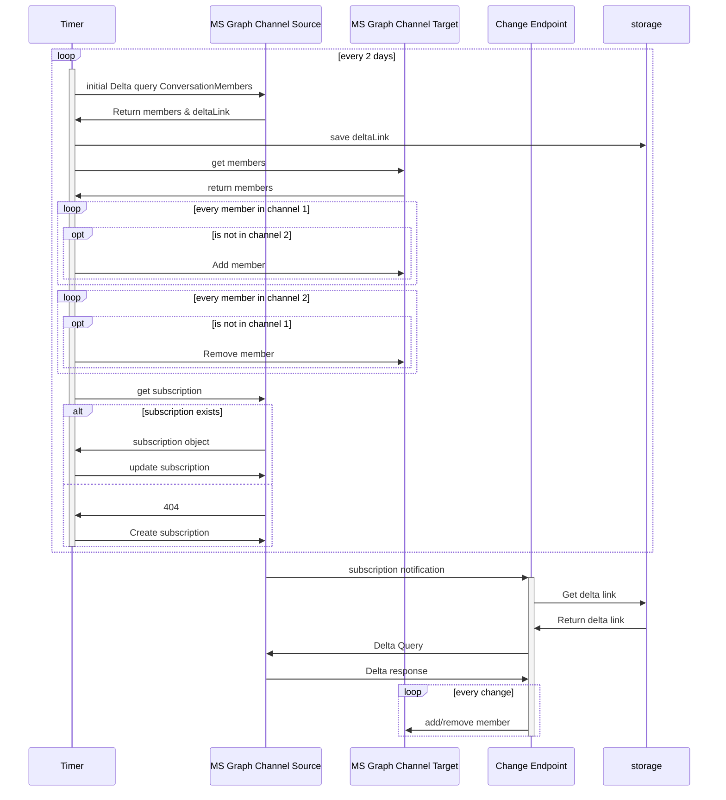

# MSTeamsChannelSyncer

Synchronize members of private Microsoft teams channels

## Roadmap

- [x] Full synchronizations on timer
- [ ] Full Synchronization on changes
- [ ] Delta synchronization on changes
- [ ] Two way sync
- [ ] Also sync the Roles of users

## Required Configuration

The AppSettings must contain the following settings:

- `SourceTeamId`
- `SourceChannelId`
- `TargetTeamId`
- `TargetChannelId`

To obtain these information, copy the link to each channel:

`https://teams.microsoft.com/l/channel/<ChannelId>/Target?groupId=<TeamId>&tenantId=<ignore the tenant id>&ngc=true`

If you cant copy the link to the channel, you can open up the Channel in a browser and use the `threadid` replace `:` with url encoded `%3A`. The Team Id can be used from copying the link to the general channel.

## Architecture

As membership changes may not happen often the solution uses serverless Azure functions. To avoid polling the API, subscriptions are used. Although full synchronization would hurt that much, the solution uses DeltaQueries to only poll changes instead of comparing all members.

## Local Development

See [./local_development/README.md](./local_development/README.md).
