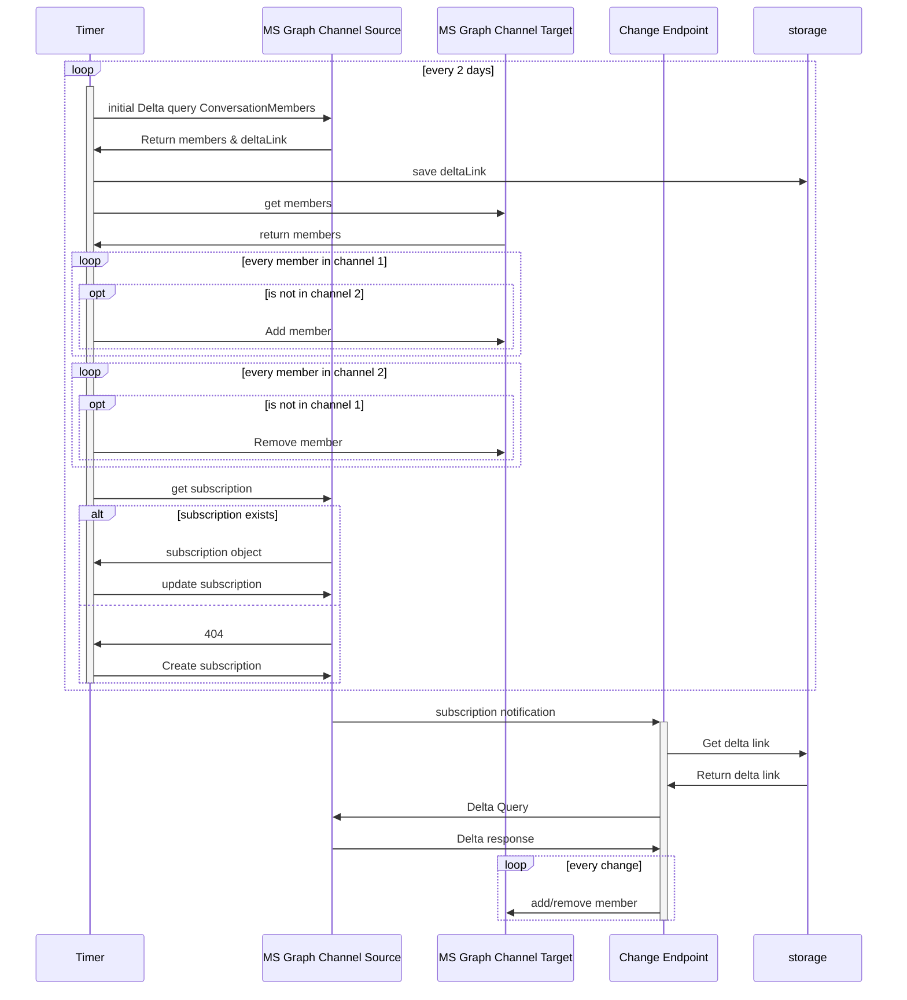

# MSTeamsChannelSyncer

Synchronize members of private Microsoft teams channels

## Roadmap

- [ ] Full synchronizations on timer
- [ ] Delta synchronization on timer
- [ ] Delta synchronization on changes
- [ ] Two way sync
- [ ] Also sync the Roles of users

## Required Configuration

The AppSettings must contain the following settings:

- `SourceTeamId`
- `SourceChannelId`
- `TargetTeamId`
- `TargetChannelId`

To obtain these information, copy the link to each channel:

`https://teams.microsoft.com/l/channel/<ChannelId>/Target?groupId=<TeamId>&tenantId=<ignore the tenant id>&ngc=true`

## Architecture

As membership changes may not happen often the solution uses serverless Azure functions. To avoid polling the API, subscriptions are used. Although full synchronization would hurt that much, the solution uses DeltaQueries to only poll changes instead of comparing all members.



## Local Development

1. Add the required app settings to `src\local.settings.json`

```json
{
  "IsEncrypted": false,
  "Values": {
    "AzureWebJobsStorage": "UseDevelopmentStorage=true",
    "FUNCTIONS_WORKER_RUNTIME": "dotnet-isolated",
    "SourceTeamId": "1a2132134-d3434-2134-21323-wre2342354",
    "SourceChannelId": "19%3876jhhgAjhhgugu%40thread.tacv2",
    "TargetTeamId": "1a2132134-d3434-2134-21323-wre2342354",
    "TargetChannelId": "19%Akhih987asai9uhiu%40thread.tacv2"
  }
}
```

2. Authenticate to Azure
